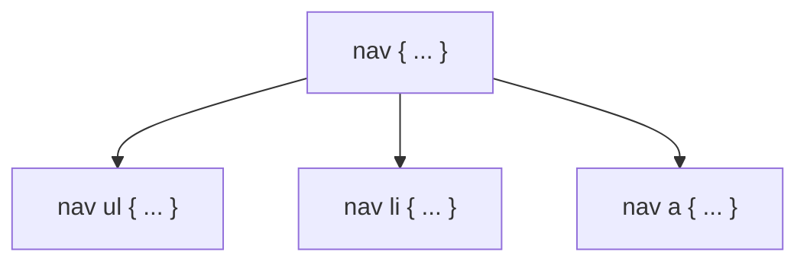
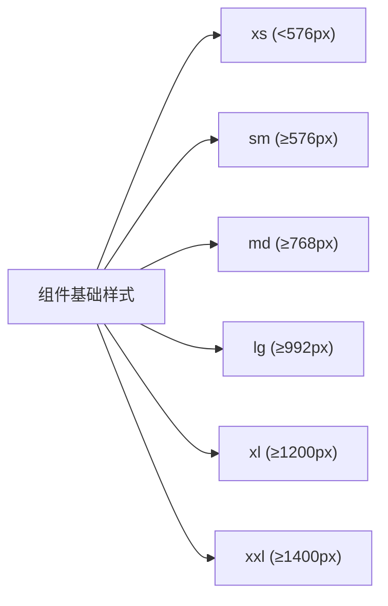

## Sass 变量基础

Tags: #Sass #Sass/Beginner #Sass/Variables

```scss
// Sass 代码
$font-stack: Helvetica, sans-serif;
$primary-color: #333;

body {
  font: 100% $font-stack;
  color: $primary-color;
}
```

```css
/* 编译后的 CSS */
body {
  font: 100% Helvetica, sans-serif;
  color: #333;
}
```

---

这个例子展示了 Sass 变量的基本用法。

### 变量定义与使用
- {{`$font-stack`}} 和 {{`$primary-color`}} 是两个 Sass 变量
- Sass 使用 {{`$`}} 符号来声明变量
- 变量可以存储字体、颜色、尺寸等任何 CSS 值
- 通过 {{`$变量名`}} 语法在样式声明中引用变量

### 变量的优势
1. **可维护性**：在单一位置定义值，便于全局修改
2. **一致性**：确保整个样式表中使用相同的值
3. **语义化**：通过变量名传达值的用途，增强代码可读性

> 💡 提示：为变量选择有意义的名称，反映其用途而非值本身（如使用 `$primary-color` 而非 `$blue`）

***

## Sass 选择器嵌套

Tags: #Sass #Sass/Beginner #Sass/Nesting

```scss
// Sass 代码
nav {
  ul {
    margin: 0;
    padding: 0;
    list-style: none;
  }

  li { 
    display: inline-block; 
  }

  a {
    display: block;
    padding: 6px 12px;
    text-decoration: none;
  }
}
```

```css
/* 编译后的 CSS */
nav ul {
  margin: 0;
  padding: 0;
  list-style: none;
}

nav li {
  display: inline-block;
}

nav a {
  display: block;
  padding: 6px 12px;
  text-decoration: none;
}
```

```html
<nav>
  <ul>
    <li><a href="#">首页</a></li>
    <li><a href="#">关于</a></li>
    <li><a href="#">联系我们</a></li>
  </ul>
</nav>
```

---

这个示例展示了 Sass 的嵌套选择器功能。

### 嵌套规则
- 可以将 CSS 选择器按照 HTML 的层级结构进行嵌套
- 内部选择器 {{`ul`}}、{{`li`}} 和 {{`a`}} 都嵌套在 {{`nav`}} 选择器内部
- Sass 编译时会自动将嵌套选择器转换为标准 CSS 选择器

### 嵌套选择器的编译过程



### 嵌套的优势
1. **可读性**：代码结构反映 HTML 的层级关系
2. **组织性**：相关选择器分组在一起
3. **减少重复**：避免反复书写相同的父选择器

> ⚠️ 警告：嵌套不宜过深（通常不超过 3 层），以避免生成过于特定的 CSS 选择器，影响样式优先级和性能。

***

## Sass 父选择器引用

Tags: #Sass #Sass/Beginner #Sass/Nesting

```scss
// Sass 代码
.button {
  background: blue;
  color: white;
  padding: 10px 15px;
  border: none;
  border-radius: 4px;
  
  &:hover {
    background: darkblue;
  }
  
  &:active {
    transform: translateY(1px);
  }
  
  &--secondary {
    background: gray;
    
    &:hover {
      background: darkgray;
    }
  }
  
  &__icon {
    margin-right: 5px;
  }
}
```

```css
/* 编译后的 CSS */
.button {
  background: blue;
  color: white;
  padding: 10px 15px;
  border: none;
  border-radius: 4px;
}
.button:hover {
  background: darkblue;
}
.button:active {
  transform: translateY(1px);
}
.button--secondary {
  background: gray;
}
.button--secondary:hover {
  background: darkgray;
}
.button__icon {
  margin-right: 5px;
}
```

```html
<button class="button">普通按钮</button>
<button class="button--secondary">次级按钮</button>
<button class="button"><span class="button__icon">★</span>带图标按钮</button>
```

---

这个示例展示了 Sass 中父选择器引用符号 `&` 的多种用法。

### 父选择器引用
- {{`&`}} 符号代表父选择器名称
- {{`&:hover`}} 和 {{`&:active`}} 编译为伪类选择器 `.button:hover` 和 `.button:active`
- {{`&--secondary`}} 使用 BEM 命名法，编译为 `.button--secondary`（修饰符）
- {{`&__icon`}} 编译为 `.button__icon`（元素）

### 父选择器引用的应用场景
1. **添加伪类/伪元素**：{{`&:hover`}}、{{`&::before`}}
2. **BEM 命名法**：{{`&--modifier`}}（修饰符）和 {{`&__element`}}（元素）
3. **状态类**：{{`&.is-active`}}、{{`&.is-disabled`}}
4. **媒体查询嵌套**：可在选择器内嵌套媒体查询

### 父选择器引用的优势
- 简化 BEM 方法论的实现
- 将相关样式保持在一起，提高可维护性
- 减少重复书写选择器名称
- 清晰表达组件不同状态和变体的样式关系

> 💡 技巧：结合 BEM 命名法和父选择器引用，可以创建出高度模块化、可维护的组件样式结构。

***

## Sass Mixins 基础

Tags: #Sass #Sass/Intermediate #Sass/Mixins

```scss
// Sass 代码
@mixin theme($theme: DarkGray) {
  background: $theme;
  box-shadow: 0 0 1px rgba($theme, .25);
  color: white;
}

.info {
  @include theme;
}

.alert {
  @include theme($theme: DarkRed);
}

.success {
  @include theme($theme: DarkGreen);
}
```

```css
/* 编译后的 CSS */
.info {
  background: DarkGray;
  box-shadow: 0 0 1px rgba(169, 169, 169, 0.25);
  color: white;
}

.alert {
  background: DarkRed;
  box-shadow: 0 0 1px rgba(139, 0, 0, 0.25);
  color: white;
}

.success {
  background: DarkGreen;
  box-shadow: 0 0 1px rgba(0, 100, 0, 0.25);
  color: white;
}
```

---

这个示例展示了 Sass 中 Mixins 的基本用法。

### Mixin 定义与使用
- 使用 {{`@mixin`}} 关键字定义可重用的样式代码块
- 通过 {{`@include`}} 关键字在选择器中使用 mixin
- Mixin 可以接收参数，如 {{`$theme`}}
- 可以为参数设置默认值，如 {{`$theme: DarkGray`}}
- 使用时可通过命名参数传值：{{`@include theme($theme: DarkRed)`}}

### Mixin 参数处理
- 参数可以是任何 Sass 支持的数据类型
- 支持默认参数值
- 支持命名参数和位置参数
- 可以在 mixin 内部使用条件语句处理参数

### Mixin 的优势
1. **减少重复代码**：将常用样式组合封装为可重用代码块
2. **提高可维护性**：集中管理常用样式组合
3. **提高灵活性**：通过参数实现样式变体
4. **简化复杂样式**：特别适合处理浏览器前缀等重复性高的样式

> 💡 提示：Mixin 非常适合处理需要多个相关属性组合的样式，如 flexbox 布局、网格系统等。

***

## Sass 继承与占位符选择器

Tags: #Sass #Sass/Intermediate #Sass/Extend

```scss
// Sass 代码
/* 这个样式会被编译，因为它被继承了 */
%message-shared {
  border: 1px solid #ccc;
  padding: 10px;
  color: #333;
}

// 这个样式不会被编译，因为它从未被继承
%equal-heights {
  display: flex;
  flex-wrap: wrap;
}

.message {
  @extend %message-shared;
}

.success {
  @extend %message-shared;
  border-color: green;
}

.error {
  @extend %message-shared;
  border-color: red;
}

.warning {
  @extend %message-shared;
  border-color: yellow;
}
```

```css
/* 编译后的 CSS */
/* 这个样式会被编译，因为它被继承了 */
.message, .success, .error, .warning {
  border: 1px solid #ccc;
  padding: 10px;
  color: #333;
}

.success {
  border-color: green;
}

.error {
  border-color: red;
}

.warning {
  border-color: yellow;
}
```

---

这个示例展示了 Sass 中继承和占位符选择器的使用。

### 继承与占位符
- {{`%message-shared`}} 是一个占位符选择器（placeholder selector）
- 占位符选择器以 {{`%`}} 开头，不会被单独编译到 CSS 中
- 使用 {{`@extend`}} 指令从其他选择器继承样式
- {{`@extend %message-shared`}} 表示继承占位符选择器的所有样式
- 只有被继承的占位符选择器才会出现在编译后的 CSS 中

### 编译结果分析
- Sass 通过组合选择器实现继承，生成 `.message, .success, .error, .warning`
- 这种方式比 mixin 更节省代码量（不重复声明相同属性）
- 特定类的额外样式（如 `.success` 的绿色边框）保持不变

### 继承的适用场景
1. **共享基础样式**：不同元素需要共享一组基础样式
2. **语义化变体**：如消息框的成功、错误、警告等变体
3. **减少重复代码**：比复制粘贴更易维护，比 mixin 更省代码量

### 继承的注意事项
- {{`@extend`}} 会影响选择器的顺序和优先级
- 过度使用会导致复杂的选择器组合
- 在媒体查询中使用 {{`@extend`}} 有限制

> ⚠️ 警告：使用 {{`@extend`}} 时要小心，它可能导致 CSS 选择器链过长。在大型项目中，通常推荐优先使用 mixins。 

## Sass 运算符与数学函数

Tags: #Sass #Sass/Intermediate #Sass/Operators #Sass/Math

```scss
// Sass 代码
@use "sass:math";

.container {
  display: flex;
}

article[role="main"] {
  width: math.div(600px, 960px) * 100%;
}

aside[role="complementary"] {
  width: math.div(300px, 960px) * 100%;
  margin-left: auto;
}
```

```css
/* 编译后的 CSS */
.container {
  display: flex;
}

article[role="main"] {
  width: 62.5%;
}

aside[role="complementary"] {
  width: 31.25%;
  margin-left: auto;
}
```

```html
<div class="container">
  <article role="main">主要内容区域</article>
  <aside role="complementary">侧边栏区域</aside>
</div>
```

---

这个示例展示了 Sass 中的数学运算功能。

### 数学模块与运算符
- {{`@use "sass:math"`}} 导入 Sass 内置的数学模块
- {{`math.div()`}} 函数用于除法运算（在新版 Sass 中替代了直接使用 `/` 进行除法）
- 可以结合使用不同单位进行计算：{{`math.div(600px, 960px) * 100%`}}
- 自动计算并转换为百分比值

### 常用运算符
- 加法：`+` 
- 减法：`-`
- 乘法：`*`
- 除法：{{`math.div()`}}
- 取模：`%`

### 单位计算
- Sass 能够进行单位间的智能计算
- 上例中 {{`math.div(600px, 960px)`}} 计算得到 0.625（无单位）
- 乘以 100% 后得到 62.5%
- 这种计算方式特别适合创建响应式布局的栅格系统

### 数学运算的应用场景
1. **栅格系统**：计算列宽百分比
2. **像素与 rem/em 转换**：基于基准值计算相对单位
3. **颜色计算**：调整颜色明度、饱和度等
4. **间距计算**：根据基准间距派生其他尺寸

> 💡 提示：在 Sass 中使用数学函数可以创建灵活的、可计算的样式系统，特别适合响应式设计。

***

## Sass 模块化与导入

Tags: #Sass #Sass/Intermediate #Sass/Import

```scss
// _base.scss
$font-stack: Helvetica, sans-serif;
$primary-color: #333;

body {
  font: 100% $font-stack;
  color: $primary-color;
}
```

```scss
// styles.scss
@use 'base';

.inverse {
  background-color: base.$primary-color;
  color: white;
}
```

```css
/* 编译后的 CSS (styles.css) */
body {
  font: 100% Helvetica, sans-serif;
  color: #333;
}

.inverse {
  background-color: #333;
  color: white;
}
```

---

这个示例展示了 Sass 中的模块化系统。

### 模块化与部分文件
- {{`_base.scss`}} 的文件名以下划线开头，表示这是一个部分文件（partial）
- 部分文件不会被单独编译成 CSS 文件，而是用于导入到其他 Sass 文件中
- {{`@use 'base'`}} 指令导入部分文件（注意省略了下划线和扩展名）
- 导入后的变量、混合器等需要使用命名空间访问，如 {{`base.$primary-color`}}

### 模块系统的变化
- 旧版 Sass 使用 {{`@import`}}，会将所有内容合并到同一命名空间
- 新版 Sass 推荐使用 {{`@use`}}，提供更好的命名空间隔离
- {{`@use`}} 创建基于文件名的命名空间，避免命名冲突
- 可以使用 {{`@use 'file' as namespace`}} 自定义命名空间

### 模块组织的优势
1. **代码组织**：将相关功能分组到单独文件
2. **可维护性**：小文件更易于理解和维护
3. **可重用性**：部分文件可在多个项目间共享
4. **命名空间隔离**：避免大型项目中的命名冲突

### 常见的模块化结构
```
sass/
|– abstracts/
|   |– _variables.scss    # 变量
|   |– _functions.scss    # 函数
|   |– _mixins.scss       # 混合器
|– base/
|   |– _reset.scss        # 重置样式
|   |– _typography.scss   # 排版规则
|– components/
|   |– _buttons.scss      # 按钮
|   |– _forms.scss        # 表单
|– layout/
|   |– _header.scss       # 页头
|   |– _footer.scss       # 页脚
|– pages/
|   |– _home.scss         # 首页专属样式
|– main.scss              # 主入口文件
```

> 💡 提示：这种结构被称为"7-1 模式"，是一种流行的 Sass 项目组织方法。

***

## Sass 控制指令：条件语句

Tags: #Sass #Sass/Advanced #Sass/Control

```scss
// Sass 代码
@mixin text-variant($color, $background: null) {
  color: $color;
  
  @if $background != null {
    background-color: $background;
    
    @if lightness($background) < 50% {
      // 深色背景使用白色文本
      color: white;
    } @else {
      // 浅色背景使用黑色文本
      color: black;
    }
  }
}

.message-info {
  @include text-variant(blue);
}

.message-error {
  @include text-variant(red, #ffeeee);
}

.message-warning {
  @include text-variant(orange, #333333);
}
```

```css
/* 编译后的 CSS */
.message-info {
  color: blue;
}

.message-error {
  color: black;
  background-color: #ffeeee;
}

.message-warning {
  color: white;
  background-color: #333333;
}
```

---

这个示例展示了 Sass 中条件语句的使用。

### 条件指令
- {{`@if`}} 指令根据条件决定是否执行代码块
- {{`@else`}} 指令提供备选分支
- 支持比较运算符：`==`，`!=`，`>`，`<`，`>=`，`<=`
- 支持逻辑运算符：`and`，`or`，`not`

### 条件判断分析
1. 首先检查 {{`$background != null`}}，判断是否提供了背景色
2. 如果有背景色，设置 {{`background-color`}} 属性
3. 然后使用 {{`lightness()`}} 函数检查背景色的亮度
4. 根据亮度自动设置适合的文本颜色（深色背景用白色文本，浅色背景用黑色文本）

### 条件语句的应用场景
1. **响应式设计**：基于断点生成不同样式
2. **主题切换**：基于主题变量调整样式
3. **组件变体**：根据参数生成不同样式变体
4. **兼容性处理**：根据条件添加特定浏览器支持
5. **可访问性优化**：如上例中基于背景色自动调整文本颜色以确保对比度

> 💡 提示：条件语句让 Sass 能够创建智能样式，根据上下文自动调整，减少手动调整的需要。

***

## Sass 控制指令：循环

Tags: #Sass #Sass/Advanced #Sass/Control

```scss
// Sass 代码
// 创建网格系统
$grid-columns: 12;

// @for 循环
@for $i from 1 through $grid-columns {
  .col-#{$i} {
    width: math.div(100%, $grid-columns) * $i;
  }
}

// 定义断点 Map
$breakpoints: (
  "sm": 576px,
  "md": 768px,
  "lg": 992px,
  "xl": 1200px
);

// @each 循环
@each $name, $width in $breakpoints {
  @media (min-width: $width) {
    .d-#{$name}-none {
      display: none;
    }
    .d-#{$name}-block {
      display: block;
    }
    .d-#{$name}-flex {
      display: flex;
    }
  }
}

// 生成间距工具类
$spacer: 1rem;
$spacers: (0, 1, 2, 3, 4, 5);

// @each 循环遍历数组
@each $size in $spacers {
  .mt-#{$size} {
    margin-top: $spacer * $size;
  }
  .mb-#{$size} {
    margin-bottom: $spacer * $size;
  }
}
```

```css
/* 编译后的 CSS (部分) */
.col-1 {
  width: 8.3333333333%;
}
.col-2 {
  width: 16.6666666667%;
}
/* ... 更多列 ... */
.col-12 {
  width: 100%;
}

@media (min-width: 576px) {
  .d-sm-none {
    display: none;
  }
  .d-sm-block {
    display: block;
  }
  .d-sm-flex {
    display: flex;
  }
}
/* ... 更多媒体查询 ... */

.mt-0 {
  margin-top: 0rem;
}
.mb-0 {
  margin-bottom: 0rem;
}
/* ... 更多间距类 ... */
```

---

这个示例展示了 Sass 中循环指令的强大功能。

### 循环指令类型
1. **{{`@for`}} 循环**：用于遍历数字范围
   - {{`@for $i from 1 through 12`}} - 从 1 到 12（包含 12）
   - {{`@for $i from 1 to 12`}} - 从 1 到 11（不包含 12）

2. **{{`@each`}} 循环**：用于遍历列表或映射
   - 遍历列表：{{`@each $size in $spacers`}}
   - 遍历映射：{{`@each $name, $width in $breakpoints`}}

3. **{{`@while`}} 循环**（示例中未使用）：基于条件重复执行

### 字符串插值
- {{`#{$变量}`}} 语法用于在选择器名、属性名等位置插入变量值
- 例如：{{`.col-#{$i}`}} 生成 `.col-1`、`.col-2` 等
- 例如：{{`.d-#{$name}-none`}} 生成 `.d-sm-none`、`.d-md-none` 等

### 循环应用场景
1. **栅格系统**：生成不同宽度的列类
2. **响应式工具类**：为不同断点生成显示/隐藏类
3. **间距系统**：生成边距、内边距工具类
4. **颜色系统**：生成各种颜色变体的类
5. **动画序列**：生成延迟不同的动画类

> 💡 提示：循环指令是创建大型系统性 CSS 框架（如 Bootstrap）的关键工具，能自动生成大量相关样式而无需手写。

***

## Sass Maps 数据结构

Tags: #Sass #Sass/Advanced #Sass/Maps

```scss
// Sass 代码
// 定义颜色系统
$colors: (
  "primary": #007bff,
  "secondary": #6c757d,
  "success": #28a745,
  "danger": #dc3545,
  "warning": #ffc107,
  "info": #17a2b8
);

// 创建颜色变体
@each $name, $color in $colors {
  .text-#{$name} {
    color: $color;
  }
  
  .bg-#{$name} {
    background-color: $color;
  }
  
  .border-#{$name} {
    border-color: $color;
  }
  
  // 生成不同透明度的背景
  @for $opacity from 1 through 9 {
    .bg-#{$name}-#{$opacity} {
      background-color: rgba($color, $opacity * 0.1);
    }
  }
}

// 使用 map-get 获取特定值
.brand-gradient {
  background: linear-gradient(
    45deg, 
    map-get($colors, "primary"), 
    map-get($colors, "info")
  );
}

// 断点系统
$breakpoints: (
  "xs": 0,
  "sm": 576px,
  "md": 768px,
  "lg": 992px,
  "xl": 1200px
);

@mixin media-breakpoint-up($name) {
  $min: map-get($breakpoints, $name);
  @media (min-width: $min) {
    @content;
  }
}
```

```css
/* 编译后的 CSS (部分) */
.text-primary {
  color: #007bff;
}
.bg-primary {
  background-color: #007bff;
}
.border-primary {
  border-color: #007bff;
}
.bg-primary-1 {
  background-color: rgba(0, 123, 255, 0.1);
}
/* ... 更多颜色类 ... */

.brand-gradient {
  background: linear-gradient(45deg, #007bff, #17a2b8);
}
```

```scss
// 使用自定义 mixin 示例
.feature {
  display: none;
  
  @include media-breakpoint-up("md") {
    display: block;
  }
}
```

---

这个示例展示了 Sass Maps 的使用方法及其强大功能。

### Maps 基础
- Maps 是键值对集合，类似于 JavaScript 中的对象
- 语法：{{`$map: ("key1": value1, "key2": value2)`}}
- 使用 {{`map-get($map, "key")`}} 函数获取值
- 使用 {{`map-has-key($map, "key")`}} 检查键是否存在

### Maps 相关函数
- {{`map-get($map, $key)`}} - 获取指定键的值
- {{`map-merge($map1, $map2)`}} - 合并两个 map
- {{`map-keys($map)`}} - 返回所有键的列表
- {{`map-values($map)`}} - 返回所有值的列表
- {{`map-remove($map, $keys...)`}} - 从 map 中移除键

### Maps 的应用场景
1. **主题系统**：存储颜色、尺寸等主题变量
2. **响应式断点**：定义和管理媒体查询断点
3. **配置选项**：集中管理各种配置参数
4. **变体系统**：管理组件的不同变体
5. **国际化**：存储不同语言的文本值

### 与循环结合使用
- 使用 {{`@each`}} 遍历 Maps 自动生成相关类
- 可结合 {{`@for`}} 生成更复杂的变体
- 使用字符串插值 {{`#{$变量}`}} 动态生成选择器名

> 💡 提示：Maps 是 Sass 中组织相关数据的强大工具，特别适合管理设计系统中的变量集合，如色彩系统、排版系统等。 

## Sass 混合器与函数结合使用

Tags: #Sass #Sass/Advanced #Sass/Mixins #Sass/Functions

```scss
// Sass 代码
@use "sass:math";
@use "sass:color";

// 函数：计算对比色
@function contrast-color($color) {
  $luminance: 0.2126 * red($color) + 0.7152 * green($color) + 0.0722 * blue($color);
  @return if($luminance > 128, #000000, #ffffff);
}

// 函数：计算适配尺寸
@function calc-size($base-size, $scale, $unit: px) {
  @return math.round($base-size * $scale) + $unit;
}

// Mixin：创建按钮
@mixin button-variant($bg-color, $radius: 4px) {
  $text-color: contrast-color($bg-color);
  $hover-color: color.scale($bg-color, $lightness: -10%);
  $active-color: color.scale($bg-color, $lightness: -15%);
  
  background-color: $bg-color;
  color: $text-color;
  border: none;
  border-radius: $radius;
  padding: calc-size(8, 1) calc-size(16, 1);
  font-size: calc-size(14, 1);
  cursor: pointer;
  transition: background-color 0.2s;
  
  &:hover {
    background-color: $hover-color;
  }
  
  &:active {
    background-color: $active-color;
  }
}

// 应用混合器
.btn-primary {
  @include button-variant(#3498db);
}

.btn-success {
  @include button-variant(#2ecc71, 8px);
}

.btn-danger {
  @include button-variant(#e74c3c);
}
```

```css
/* 编译后的 CSS */
.btn-primary {
  background-color: #3498db;
  color: #ffffff;
  border: none;
  border-radius: 4px;
  padding: 8px 16px;
  font-size: 14px;
  cursor: pointer;
  transition: background-color 0.2s;
}
.btn-primary:hover {
  background-color: #2077b2;
}
.btn-primary:active {
  background-color: #196090;
}

.btn-success {
  background-color: #2ecc71;
  color: #000000;
  border: none;
  border-radius: 8px;
  padding: 8px 16px;
  font-size: 14px;
  cursor: pointer;
  transition: background-color 0.2s;
}
.btn-success:hover {
  background-color: #25a25a;
}
.btn-success:active {
  background-color: #1e8449;
}

.btn-danger {
  background-color: #e74c3c;
  color: #ffffff;
  border: none;
  border-radius: 4px;
  padding: 8px 16px;
  font-size: 14px;
  cursor: pointer;
  transition: background-color 0.2s;
}
.btn-danger:hover {
  background-color: #d62c1a;
}
.btn-danger:active {
  background-color: #a82315;
}
```

```html
<button class="btn-primary">主要按钮</button>
<button class="btn-success">成功按钮</button>
<button class="btn-danger">危险按钮</button>
```

---

这个示例展示了 Sass 中混合器与函数的组合使用。

### 函数与混合器的区别
- {{`@function`}} 用于返回计算值，不直接生成 CSS
- {{`@mixin`}} 用于生成 CSS 代码块
- 函数使用 {{`@return`}} 返回值
- 混合器使用 {{`@content`}} 接收额外内容（本例未使用）

### 颜色处理函数
- {{`red($color)`}}、{{`green($color)`}}、{{`blue($color)`}} 获取颜色的 RGB 分量
- {{`color.scale($color, $lightness: -10%)`}} 调整颜色亮度
- 自定义函数 {{`contrast-color()`}} 根据背景颜色亮度计算适合的文本颜色

### 混合器与函数组合优势
1. **代码模块化**：将逻辑计算与样式生成分离
2. **可重用性**：函数可在多个混合器中共享
3. **设计系统自动化**：自动计算合适的颜色组合
4. **强大的样式生成**：基于简单输入生成复杂样式
5. **智能默认值**：根据上下文自动调整样式

### 应用流程
1. 定义通用计算函数 ({{`contrast-color`}}、{{`calc-size`}})
2. 创建使用这些函数的混合器 ({{`button-variant`}})
3. 在选择器中应用混合器，传入所需参数

> 💡 提示：函数和混合器的结合使用是创建智能、灵活设计系统的基础。通过函数处理逻辑计算，通过混合器生成样式，可以构建出既灵活又一致的组件库。

***

## Sass 响应式设计模式

Tags: #Sass #Sass/Advanced #Sass/Responsive

```scss
// Sass 代码
// 断点系统
$breakpoints: (
  "xs": 0,
  "sm": 576px,
  "md": 768px,
  "lg": 992px,
  "xl": 1200px,
  "xxl": 1400px
);

// 响应式 mixins
@mixin media-up($breakpoint) {
  @if map-has-key($breakpoints, $breakpoint) {
    $min-width: map-get($breakpoints, $breakpoint);
    @media (min-width: $min-width) {
      @content;
    }
  } @else {
    @warn "未知断点：#{$breakpoint}";
  }
}

@mixin media-down($breakpoint) {
  @if map-has-key($breakpoints, $breakpoint) {
    $max-width: map-get($breakpoints, $breakpoint) - 0.02px;
    @media (max-width: $max-width) {
      @content;
    }
  } @else {
    @warn "未知断点：#{$breakpoint}";
  }
}

@mixin media-between($lower, $upper) {
  @if map-has-key($breakpoints, $lower) and map-has-key($breakpoints, $upper) {
    $min-width: map-get($breakpoints, $lower);
    $max-width: map-get($breakpoints, $upper) - 0.02px;
    @media (min-width: $min-width) and (max-width: $max-width) {
      @content;
    }
  } @else {
    @warn "未知断点：#{$lower} 或 #{$upper}";
  }
}

// 使用断点系统
.container {
  width: 100%;
  padding: 15px;
  margin: 0 auto;
  
  @include media-up("sm") {
    max-width: 540px;
  }
  
  @include media-up("md") {
    max-width: 720px;
  }
  
  @include media-up("lg") {
    max-width: 960px;
  }
  
  @include media-up("xl") {
    max-width: 1140px;
  }
  
  @include media-up("xxl") {
    max-width: 1320px;
  }
}

// 响应式卡片组件
.card {
  border: 1px solid #ddd;
  border-radius: 4px;
  padding: 15px;
  
  &__title {
    font-size: 16px;
    margin-bottom: 10px;
    
    @include media-up("md") {
      font-size: 18px;
    }
    
    @include media-up("lg") {
      font-size: 20px;
    }
  }
  
  &__content {
    font-size: 14px;
    
    @include media-up("md") {
      font-size: 16px;
    }
  }
  
  @include media-down("sm") {
    padding: 10px;
  }
  
  @include media-between("md", "lg") {
    box-shadow: 0 2px 4px rgba(0, 0, 0, 0.1);
  }
}
```

```css
/* 编译后的 CSS */
.container {
  width: 100%;
  padding: 15px;
  margin: 0 auto;
}
@media (min-width: 576px) {
  .container {
    max-width: 540px;
  }
}
@media (min-width: 768px) {
  .container {
    max-width: 720px;
  }
}
@media (min-width: 992px) {
  .container {
    max-width: 960px;
  }
}
@media (min-width: 1200px) {
  .container {
    max-width: 1140px;
  }
}
@media (min-width: 1400px) {
  .container {
    max-width: 1320px;
  }
}

.card {
  border: 1px solid #ddd;
  border-radius: 4px;
  padding: 15px;
}
.card__title {
  font-size: 16px;
  margin-bottom: 10px;
}
@media (min-width: 768px) {
  .card__title {
    font-size: 18px;
  }
}
@media (min-width: 992px) {
  .card__title {
    font-size: 20px;
  }
}
.card__content {
  font-size: 14px;
}
@media (min-width: 768px) {
  .card__content {
    font-size: 16px;
  }
}
@media (max-width: 575.98px) {
  .card {
    padding: 10px;
  }
}
@media (min-width: 768px) and (max-width: 991.98px) {
  .card {
    box-shadow: 0 2px 4px rgba(0, 0, 0, 0.1);
  }
}
```

---

这个示例展示了 Sass 中的响应式设计模式。

### 断点系统设计
- 使用 {{`$breakpoints`}} Map 存储所有断点值
- 断点遵循移动优先（mobile-first）的设计原则
- 通过 Sass Maps 集中管理断点，便于全局调整

### 响应式 Mixins
1. {{`@mixin media-up($breakpoint)`}} - 当屏幕宽度大于等于指定断点时应用样式
2. {{`@mixin media-down($breakpoint)`}} - 当屏幕宽度小于指定断点时应用样式
3. {{`@mixin media-between($lower, $upper)`}} - 当屏幕宽度在两个断点之间时应用样式

### Mixin 高级功能
- 使用 {{`@content`}} 指令插入调用者提供的内容
- 使用 {{`@warn`}} 指令在编译时显示警告消息
- 使用 {{`map-has-key()`}} 验证传入的断点名称
- 减去 0.02px 避免媒体查询重叠（解决浮点数精度问题）

### 响应式设计模式
1. **容器自适应**：根据不同屏幕宽度设置不同的最大宽度
2. **组件响应调整**：调整内边距、字体大小等细节
3. **条件样式**：只在特定屏幕范围应用某些样式（如中等屏幕的阴影）
4. **嵌套媒体查询**：在选择器内部直接嵌套媒体查询，保持样式的关联性



> 💡 提示：通过这种方式创建的响应式系统，既保持了代码的组织性，又提供了灵活的媒体查询 API，简化了复杂响应式布局的实现。

***

## Sass 列表处理与高级函数

Tags: #Sass #Sass/Advanced #Sass/Lists #Sass/Functions

```scss
// Sass 代码
@use "sass:list";
@use "sass:math";

// 定义间距列表
$spacers: (0, 0.25rem, 0.5rem, 1rem, 1.5rem, 3rem);

// 函数：获取列表中的值
@function spacer($index) {
  @if $index >= 0 and $index < list.length($spacers) {
    @return list.nth($spacers, $index + 1);
  } @else {
    @warn "索引 #{$index} 超出了 $spacers 列表的范围";
    @return 0;
  }
}

// 函数：生成渐变色列表
@function generate-gradient-stops($color, $steps: 5) {
  $result: ();
  @for $i from 0 through $steps {
    $percent: math.percentage(math.div($i, $steps));
    $shade: mix(black, $color, math.div($i, $steps) * 100%);
    $result: list.append($result, $shade $percent, comma);
  }
  @return $result;
}

// 使用列表函数生成间距工具类
@each $i, $value in list.zip((0, 1, 2, 3, 4, 5), $spacers) {
  $index: list.nth($value, 1);
  $size: list.nth($value, 2);
  
  .m-#{$index} {
    margin: $size;
  }
  
  .p-#{$index} {
    padding: $size;
  }
  
  @each $dir, $prop in (
    "t": "top",
    "r": "right",
    "b": "bottom",
    "l": "left"
  ) {
    .m#{$dir}-#{$index} {
      margin-#{$prop}: $size;
    }
    
    .p#{$dir}-#{$index} {
      padding-#{$prop}: $size;
    }
  }
}

// 使用渐变色函数
.gradient-primary {
  background: linear-gradient(45deg, generate-gradient-stops(#007bff));
}

.custom-spacing {
  margin-top: spacer(3);    // 1rem
  padding: spacer(2);       // 0.5rem
}
```

```css
/* 编译后的 CSS (部分) */
.m-0 {
  margin: 0;
}
.p-0 {
  padding: 0;
}
.mt-0 {
  margin-top: 0;
}
/* ... 更多间距类 ... */

.gradient-primary {
  background: linear-gradient(45deg, #007bff 0%, #0062cc 25%, #004c99 50%, #003566 75%, #001f33 100%);
}

.custom-spacing {
  margin-top: 1rem;
  padding: 0.5rem;
}
```

---

这个示例展示了 Sass 列表处理和高级函数的使用。

### Sass 列表基础
- 列表是 Sass 中的有序数据类型，类似于数组
- 定义语法：{{`$list: (item1, item2, item3)`}}
- 通过 {{`list.nth($list, $n)`}} 访问指定位置的元素（索引从 1 开始）
- 使用 {{`list.length($list)`}} 获取列表长度

### 列表函数
- {{`list.append($list, $val, $separator)`}} - 添加元素到列表末尾
- {{`list.zip($list1, $list2)`}} - 将多个列表合并为一个列表的列表
- {{`list.index($list, $value)`}} - 查找元素在列表中的位置
- {{`list.join($list1, $list2, $separator)`}} - 合并两个列表

### 高级函数设计
1. {{`spacer($index)`}} 函数：
   - 从间距列表中获取指定索引的值
   - 添加了边界检查和错误警告
   - 提供了友好的访问 API

2. {{`generate-gradient-stops($color, $steps)`}} 函数：
   - 动态生成渐变色停止点列表
   - 使用 {{`mix()`}} 函数混合颜色
   - 使用 {{`list.append()`}} 构建结果列表

### 函数与列表的应用场景
1. **间距系统**：管理一致的边距和内边距值
2. **颜色系统**：生成颜色阶梯和渐变
3. **工具类生成**：创建实用工具类
4. **数据处理**：处理和转换配置数据

### 与循环结合使用
- 使用 {{`list.zip()`}} 同时遍历两个列表
- 使用 {{`@each`}} 遍历列表和映射生成类
- 嵌套循环生成更复杂的类组合

> 💡 提示：掌握列表和函数的高级用法，能够显著提高 Sass 代码的抽象能力和可维护性，特别适合大型设计系统的开发。

***

## Sass 项目架构与模块化最佳实践

Tags: #Sass #Sass/Advanced #Sass/Architecture #Sass/Import

```scss
// 文件结构示例：
// 
// sass/
// ├── abstracts/
// │   ├── _variables.scss    /* 变量定义 */
// │   ├── _functions.scss    /* 函数定义 */
// │   ├── _mixins.scss       /* 混合器定义 */
// │   └── _index.scss        /* 转发模块 */
// ├── base/
// │   ├── _reset.scss        /* 样式重置 */
// │   ├── _typography.scss   /* 排版样式 */
// │   └── _index.scss        /* 转发模块 */
// ├── components/
// │   ├── _buttons.scss      /* 按钮组件 */
// │   ├── _cards.scss        /* 卡片组件 */
// │   └── _index.scss        /* 转发模块 */
// └── main.scss              /* 主入口文件 */

// abstracts/_variables.scss
$primary-color: #3498db;
$secondary-color: #2ecc71;
$text-color: #333;
$border-radius: 4px;
$spacer: 1rem;

// abstracts/_mixins.scss
@mixin flex-center {
  display: flex;
  justify-content: center;
  align-items: center;
}

// abstracts/_index.scss
@forward 'variables';
@forward 'functions';
@forward 'mixins';

// components/_buttons.scss
@use '../abstracts' as *;

.btn {
  padding: $spacer * 0.5 $spacer;
  border-radius: $border-radius;
  border: none;
  cursor: pointer;
  
  &--primary {
    background-color: $primary-color;
    color: white;
    
    &:hover {
      background-color: darken($primary-color, 10%);
    }
  }
  
  &--secondary {
    background-color: $secondary-color;
    color: white;
    
    &:hover {
      background-color: darken($secondary-color, 10%);
    }
  }
}

// components/_index.scss
@forward 'buttons';
@forward 'cards';

// main.scss
@use 'abstracts';
@use 'base';
@use 'components';

.container {
  max-width: 1200px;
  margin: 0 auto;
  padding: 0 abstracts.$spacer;
}
```

```css
/* 编译后的 CSS (部分) */
.btn {
  padding: 0.5rem 1rem;
  border-radius: 4px;
  border: none;
  cursor: pointer;
}
.btn--primary {
  background-color: #3498db;
  color: white;
}
.btn--primary:hover {
  background-color: #217dbb;
}
.btn--secondary {
  background-color: #2ecc71;
  color: white;
}
.btn--secondary:hover {
  background-color: #25a25a;
}

.container {
  max-width: 1200px;
  margin: 0 auto;
  padding: 0 1rem;
}
```

---

这个示例展示了 Sass 项目的架构和模块化最佳实践。

### 7-1 模式架构
- 一种流行的 Sass 项目组织方法，包含 7 个文件夹和 1 个主文件
- 目录结构清晰，便于维护和扩展
- 各模块职责明确，遵循单一职责原则

### 文件命名规范
- 部分文件（partials）以下划线开头，如 {{`_variables.scss`}}
- 下划线表示该文件不应单独编译，只用于导入
- 统一使用 {{`_index.scss`}} 作为文件夹的入口文件

### 模块系统使用
1. {{`@use`}} - 加载其他 Sass 文件作为模块
   - 创建命名空间，避免命名冲突
   - 例如：{{`@use '../abstracts' as *;`}} (使用 `*` 省略命名空间)

2. {{`@forward`}} - 转发模块的内容
   - 允许从单一入口访问多个文件的内容
   - 例如：{{`@forward 'variables';`}} 转发变量

### 模块化优势
1. **关注点分离**：将代码按功能和类型分组
2. **维护性**：小文件更易于理解和维护
3. **可重用性**：模块可在多个项目间共享
4. **协作效率**：团队成员可并行工作在不同模块
5. **按需加载**：只导入需要的模块

### 常见的模块分类
- **abstracts**: 不产生 CSS 的工具和辅助文件（变量、函数、混合器）
- **base**: 项目的基础样式（重置、排版、动画）
- **components**: 独立的 UI 组件（按钮、卡片、表单）
- **layout**: 页面布局相关（网格、头部、页脚）
- **pages**: 特定页面样式（首页、联系页）
- **themes**: 多主题支持
- **vendors**: 第三方库样式

> 💡 提示：良好的项目架构是大型项目成功的关键。模块化设计不仅提高了代码质量和可维护性，还能促进团队协作和代码重用。