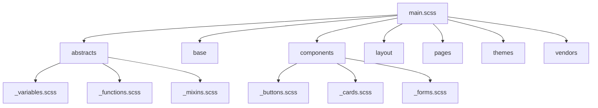

# Sass 学习卡片集

这是一个 Sass 预处理器的学习卡片集合，采用 Mochi 卡片格式，以便于记忆和学习。每张卡片都聚焦于 Sass 的一个特定特性或用法，包含示例代码、编译结果和详细解释。

## 卡片内容结构

每张卡片包含：
- Sass 代码示例
- 编译后的 CSS 代码
- 相关的 HTML 示例（如适用）
- 详细解释，包括语法、用途和最佳实践
- 使用 `{{关键词}}` 标记的关键概念，便于记忆
- 相关标签，指示难度级别和主题分类

## 卡片分类

卡片按以下主题组织：
1. **基础概念**：变量、嵌套、父选择器引用
2. **模块化**：Partials、模块系统
3. **代码复用**：Mixins、继承、占位符选择器
4. **逻辑与计算**：函数、运算符、数学操作
5. **控制流**：条件语句、循环
6. **架构与最佳实践**：7-1 架构、BEM 命名法、性能优化

使用这些卡片进行间隔重复学习，能够有效掌握 Sass 的核心概念和实践技巧。

---

## Sass 变量基础应用

Tags: #Sass #Sass/Beginner #Sass/Variables

```scss
// Sass 代码
$font-stack: Helvetica, sans-serif;
$primary-color: #333;

body {
  font: 100% $font-stack;
  color: $primary-color;
}
```

```css
/* 编译后的 CSS */
body {
  font: 100% Helvetica, sans-serif;
  color: #333;
}
```

```html
<body>
  <h1>使用 Sass 变量的页面</h1>
  <p>这个页面使用了 Sass 变量定义的字体和颜色。</p>
</body>
```

---

Sass 变量是存储和重用信息的方式，可以在样式表中多次使用。

### 变量声明与使用
- {{`$`}} 符号用于声明变量
- {{`$font-stack: Helvetica, sans-serif`}} 定义了一个字体变量
- {{`$primary-color: #333`}} 定义了一个颜色变量
- 变量通过 {{`$变量名`}} 的形式在 CSS 属性中引用

### 变量的优势
1. **一处修改，处处生效**：修改变量值后，所有使用该变量的地方都会更新
2. **提高可维护性**：集中管理颜色、字体等常用值
3. **增强代码可读性**：使用有意义的变量名比直接使用颜色代码更易理解
4. **保持一致性**：确保整个网站使用相同的品牌颜色和样式

### 注意事项
- 变量名应使用连字符命名法（如 `$primary-color`）
- 变量默认作用域为声明它的选择器内部及其子选择器
- 可以在选择器外部全局声明变量

> 💡 技巧：为品牌颜色、字体、常用间距等创建变量，形成统一的设计系统。

***

## Sass 选择器嵌套规则

Tags: #Sass #Sass/Beginner #Sass/Nesting

```scss
// Sass 代码
nav {
  ul {
    margin: 0;
    padding: 0;
    list-style: none;
  }

  li { 
    display: inline-block; 
  }

  a {
    display: block;
    padding: 6px 12px;
    text-decoration: none;
  }
}
```

```css
/* 编译后的 CSS */
nav ul {
  margin: 0;
  padding: 0;
  list-style: none;
}

nav li {
  display: inline-block;
}

nav a {
  display: block;
  padding: 6px 12px;
  text-decoration: none;
}
```

```html
<nav>
  <ul>
    <li><a href="#">首页</a></li>
    <li><a href="#">关于我们</a></li>
    <li><a href="#">服务</a></li>
    <li><a href="#">联系方式</a></li>
  </ul>
</nav>
```

---

Sass 嵌套功能让 CSS 选择器能够遵循与 HTML 相同的视觉层次结构。

### 嵌套语法
- 子选择器嵌套在父选择器的花括号内
- 编译时，Sass 会自动将嵌套选择器转换为标准 CSS 选择器
- 嵌套结构反映了 DOM 的层次结构

### 嵌套的优势
1. **可读性**：代码结构反映 HTML 结构，更易理解
2. **组织性**：相关选择器组织在一起，减少重复
3. **命名空间**：自动创建命名空间，避免样式冲突
4. **减少重复**：不需要重复书写父选择器

### 嵌套示例解析
- {{`nav { ... }`}} 是最外层的父选择器
- {{`ul { ... }`}} 嵌套在 nav 内，编译为 `nav ul`
- {{`li { ... }`}} 嵌套在 nav 内，编译为 `nav li`
- {{`a { ... }`}} 嵌套在 nav 内，编译为 `nav a`

### 注意事项
- 避免过度嵌套（通常不超过 3 层）
- 过度嵌套会生成高特异性的选择器，可能导致维护困难
- 嵌套应反映 HTML 的实际结构

> 💡 技巧：嵌套适合表示紧密关联的 UI 组件，比如导航菜单、表单等。

***

## Sass 父选择器引用

Tags: #Sass #Sass/Beginner #Sass/Nesting

```scss
// Sass 代码
.button {
  background-color: #0078d7;
  border: none;
  color: white;
  padding: 8px 16px;
  
  &:hover {
    background-color: #0056b3;
  }
  
  &:active {
    background-color: #00408a;
  }
  
  &--large {
    padding: 12px 24px;
    font-size: 1.2em;
  }
  
  &--primary {
    background-color: #4caf50;
    
    &:hover {
      background-color: #388e3c;
    }
  }
}
```

```css
/* 编译后的 CSS */
.button {
  background-color: #0078d7;
  border: none;
  color: white;
  padding: 8px 16px;
}
.button:hover {
  background-color: #0056b3;
}
.button:active {
  background-color: #00408a;
}
.button--large {
  padding: 12px 24px;
  font-size: 1.2em;
}
.button--primary {
  background-color: #4caf50;
}
.button--primary:hover {
  background-color: #388e3c;
}
```

```html
<button class="button">普通按钮</button>
<button class="button button--large">大型按钮</button>
<button class="button button--primary">主要按钮</button>
```

---

Sass 父选择器引用 `&` 是嵌套功能的强大扩展，用于在嵌套中引用外部选择器。

### 父选择器引用基础
- {{`&`}} 符号代表父选择器本身
- 在嵌套规则中使用 `&` 可以引用外部选择器
- 编译时，`&` 会被父选择器替换

### 主要用途
1. **伪类/伪元素**：{{`&:hover`}}、{{`&::before`}} 等
2. **BEM 命名法**：{{`&--modifier`}}、{{`&__element`}} 
3. **状态类**：{{`&.is-active`}}、{{`&.is-disabled`}}
4. **组合选择器**：{{`.dark-theme &`}} (在暗色主题下的样式)

### 示例解析
- {{`&:hover`}} 编译为 `.button:hover`
- {{`&:active`}} 编译为 `.button:active`
- {{`&--large`}} 编译为 `.button--large`（BEM 修饰符）
- {{`&--primary`}} 编译为 `.button--primary`（BEM 修饰符）
- 嵌套的 {{`&:hover`}} 编译为 `.button--primary:hover`

### 最佳实践
- 使用 `&` 结合 BEM 命名法组织复杂组件
- 将状态伪类（`:hover`、`:focus` 等）与它们影响的元素放在一起
- 使用 `&` 创建修饰符变体，保持代码组织
- 避免生成过于复杂的选择器链

> 💡 技巧：父选择器引用使 Sass 代码更符合组件思维，非常适合组件化开发。

***

## Sass Partials 和文件模块化

Tags: #Sass #Sass/Intermediate #Sass/Import

```scss
// _variables.scss
$primary-color: #3498db;
$secondary-color: #2ecc71;
$text-color: #333;
$font-stack: 'Roboto', sans-serif;

// _mixins.scss
@mixin flex-center {
  display: flex;
  justify-content: center;
  align-items: center;
}

@mixin box-shadow($x: 0, $y: 2px, $blur: 4px, $color: rgba(0,0,0,.1)) {
  box-shadow: $x $y $blur $color;
}

// main.scss
@use 'variables';
@use 'mixins';

body {
  font-family: variables.$font-stack;
  color: variables.$text-color;
}

.card {
  background: white;
  border-radius: 4px;
  @include mixins.box-shadow();
  
  &__header {
    @include mixins.flex-center;
    background-color: variables.$primary-color;
    color: white;
  }
}
```

```css
/* 编译后的 CSS */
body {
  font-family: "Roboto", sans-serif;
  color: #333;
}

.card {
  background: white;
  border-radius: 4px;
  box-shadow: 0 2px 4px rgba(0, 0, 0, 0.1);
}

.card__header {
  display: flex;
  justify-content: center;
  align-items: center;
  background-color: #3498db;
  color: white;
}
```

---

Sass 的模块化功能通过 Partials（部分文件）和 `@use` 规则实现，让代码更有组织性和可维护性。

### Partials 基础
- {{Partial 文件}}是以下划线开头命名的 Sass 文件，如 {{`_variables.scss`}}
- 下划线表示该文件是部分文件，不应该被单独编译为 CSS
- Partials 通常包含可重用的变量、函数或 mixins

### 模块化结构
1. **变量文件**：存储颜色、字体、尺寸等全局变量
2. **Mixin 文件**：存储可重用的 mixin 定义
3. **基础样式文件**：存储重置和基础样式
4. **组件文件**：各种 UI 组件的样式

### 使用 @use 规则
- {{`@use`}} 规则用于加载其他 Sass 文件作为模块
- 格式：{{`@use '文件路径'`}}（无需文件扩展名）
- 默认使用文件名作为命名空间，如 {{`variables.$primary-color`}}
- 可以通过 `as` 关键字自定义命名空间：{{`@use 'variables' as v;`}}

### 命名空间的好处
- 避免不同模块之间的变量和 mixin 名冲突
- 清晰表明样式元素来自哪个模块
- 组织大型项目的代码结构

### 最佳实践
- 按功能分割文件：变量、mixin、布局、组件等
- 使用统一的命名约定
- 在 `main.scss` 中汇总所有分散的 partial 文件
- 遵循 7-1 模式等组织方法（7 个文件夹，1 个主文件）

> 💡 技巧：模块化不仅提高了代码组织性，还允许多人同时在不同文件上工作，减少冲突。

***

## Sass 模块系统与命名空间

Tags: #Sass #Sass/Intermediate #Sass/Import

```scss
// _base.scss
$font-stack: Helvetica, sans-serif;
$primary-color: #333;

body {
  font: 100% $font-stack;
  color: $primary-color;
}

// styles.scss
@use 'base';

.inverse {
  background-color: base.$primary-color;
  color: white;
}
```

```css
/* 编译后的 CSS */
body {
  font: 100% Helvetica, sans-serif;
  color: #333;
}

.inverse {
  background-color: #333;
  color: white;
}
```

```html
<div class="inverse">
  这个元素使用了从 base 模块引入的主题色作为背景色
</div>
```

---

Sass 模块系统通过 `@use` 规则提供了一种组织和重用代码的强大方式。

### 模块系统核心概念
- {{`@use`}} 规则加载另一个 Sass 文件作为模块
- 被加载的文件中的变量、mixins 和函数可以通过命名空间访问
- 加载的文件中的 CSS 规则会被包含在编译输出中

### 命名空间访问语法
- 默认使用文件名（不含扩展名和下划线）作为命名空间
- 使用 {{`命名空间.$变量名`}} 的形式访问变量
- 使用 {{`命名空间.mixin名`}} 的形式访问 mixin
- 示例：{{`base.$primary-color`}} 访问 base 模块中的 $primary-color 变量

### 自定义命名空间
- 使用 `as` 关键字自定义命名空间：{{`@use 'base' as b;`}}
- 之后可以使用 {{`b.$primary-color`}} 访问变量
- 使用 {{`@use 'base' as *;`}} 可以不使用命名空间直接访问（不推荐）

### 与 @import 的区别
- `@use` 创建有命名空间的模块，避免命名冲突
- `@use` 只加载一次文件，即使被多次引用
- `@use` 变量默认是私有的，除非使用 `!global` 标记

### 最佳实践
- 使用 `@use` 而非旧式的 `@import` 规则
- 尽量避免使用 `as *` 形式，以防命名冲突
- 采用一致的模块命名约定
- 将相关功能组织在同一模块中

```mermaid
graph TD
    A[main.scss] -->|@use| B[_variables.scss]
    A -->|@use| C[_mixins.scss]
    A -->|@use| D[_base.scss]
    A -->|@use| E[_components.scss]
    E -->|@use| B
    E -->|@use| C
    D -->|@use| B
```

> 💡 技巧：良好的模块化设计可以显著提高大型项目的可维护性和协作效率。

***

## Sass Mixins 基础应用

Tags: #Sass #Sass/Intermediate #Sass/Mixins

```scss
// Sass 代码
@mixin theme($theme: DarkGray) {
  background: $theme;
  box-shadow: 0 0 1px rgba($theme, .25);
  color: #fff;
}

.info {
  @include theme;
}

.alert {
  @include theme($theme: DarkRed);
}

.success {
  @include theme($theme: DarkGreen);
}
```

```css
/* 编译后的 CSS */
.info {
  background: DarkGray;
  box-shadow: 0 0 1px rgba(169, 169, 169, 0.25);
  color: #fff;
}

.alert {
  background: DarkRed;
  box-shadow: 0 0 1px rgba(139, 0, 0, 0.25);
  color: #fff;
}

.success {
  background: DarkGreen;
  box-shadow: 0 0 1px rgba(0, 100, 0, 0.25);
  color: #fff;
}
```

```html
<div class="info">这是默认主题的信息框</div>
<div class="alert">这是红色主题的警告框</div>
<div class="success">这是绿色主题的成功框</div>
```

---

Sass Mixins 允许创建可以在整个样式表中重用的 CSS 声明组。

### Mixin 基础概念
- {{`@mixin`}} 指令用于定义可重用的样式块
- {{`@include`}} 指令用于在选择器中使用已定义的 mixin
- Mixins 可以接受参数，使其更加灵活
- 参数可以设置默认值，如 {{`$theme: DarkGray`}}

### Mixin 定义语法
```scss
@mixin 名称([$参数1: 默认值1, $参数2: 默认值2, ...]) {
  // CSS 声明
}
```

### Mixin 使用方式
1. **基本使用**：{{`@include theme;`}} - 使用默认参数
2. **传递参数**：{{`@include theme($theme: DarkRed);`}} - 指定参数值
3. **多个参数**：可以定义和传递多个参数

### 示例解析
- {{`@mixin theme($theme: DarkGray)`}} 定义了接受一个参数的 mixin
- mixin 内部使用参数来设置背景色和阴影
- {{`rgba($theme, .25)`}} 展示了在 mixin 中处理参数的能力
- `.info` 使用默认主题，`.alert` 和 `.success` 自定义主题

### Mixin 优势
1. **减少重复代码**：将常用样式组合为可重用块
2. **提高灵活性**：通过参数自定义样式
3. **简化维护**：一处修改，处处生效
4. **抽象复杂代码**：封装复杂的 CSS 属性和值

> 💡 技巧：Mixins 特别适合处理供应商前缀、媒体查询和重复使用的 CSS 模式。

***

## Sass Mixins 处理供应商前缀

Tags: #Sass #Sass/Intermediate #Sass/Mixins #Sass/Compatibility

```scss
// Sass 代码
@mixin transform($property) {
  -webkit-transform: $property;
  -ms-transform: $property;
  transform: $property;
}

.box {
  @include transform(rotate(30deg));
}

@mixin transition($properties...) {
  -webkit-transition: $properties;
  -moz-transition: $properties;
  -o-transition: $properties;
  transition: $properties;
}

.button {
  @include transition(color 0.3s ease, background-color 0.5s ease);
  
  &:hover {
    color: white;
    background-color: blue;
  }
}
```

```css
/* 编译后的 CSS */
.box {
  -webkit-transform: rotate(30deg);
  -ms-transform: rotate(30deg);
  transform: rotate(30deg);
}

.button {
  -webkit-transition: color 0.3s ease, background-color 0.5s ease;
  -moz-transition: color 0.3s ease, background-color 0.5s ease;
  -o-transition: color 0.3s ease, background-color 0.5s ease;
  transition: color 0.3s ease, background-color 0.5s ease;
}

.button:hover {
  color: white;
  background-color: blue;
}
```

---

Mixins 能有效地处理需要多个供应商前缀的 CSS 属性，减少代码重复并提高可维护性。

### 前缀处理 Mixin
- {{`@mixin transform($property)`}} 定义一个处理转换属性的 mixin
- mixin 自动为属性添加所需的所有前缀
- 使用时只需传入一次属性值：{{`@include transform(rotate(30deg))`}}

### 可变参数 Mixin
- 使用 {{`$properties...`}} 语法定义可接受多个参数的 mixin
- 所有传入的参数会作为一个列表处理
- 示例：{{`@include transition(color 0.3s ease, background-color 0.5s ease)`}}

### 可变参数原理
- 变量后面的 `...` 表示该变量可以接收多个值
- 在 mixin 内部，可变参数会被展开到需要的地方
- 非常适合处理可以有多个值的属性，如 `transition`、`box-shadow` 等

### 构建可维护的前缀系统
1. 为每个需要前缀的 CSS 属性创建专用 mixin
2. 封装所有前缀逻辑，只在一处维护
3. 在需要使用这些属性的地方，使用 mixin 而非手写前缀
4. 当浏览器支持变化时，只需更新 mixin 定义

### 最佳实践
- 仅为确实需要前缀的属性创建 mixin
- 考虑使用 Autoprefixer 等工具自动处理前缀
- 将所有前缀 mixin 集中在一个文件中管理
- 定期更新 mixin 以反映最新的浏览器支持情况

> 💡 技巧：虽然现代开发中通常使用 Autoprefixer 自动添加前缀，了解 mixin 处理前缀的原理仍然有助于理解 Sass 的能力和用法。

***

## Sass 继承与占位符选择器

Tags: #Sass #Sass/Intermediate #Sass/Extend

```scss
// Sass 代码
/* 这个 CSS 会被编译，因为 %message-shared 被继承了 */
%message-shared {
  border: 1px solid #ccc;
  padding: 10px;
  color: #333;
}

// 这个 CSS 不会被编译，因为 %equal-heights 从未被继承
%equal-heights {
  display: flex;
  flex-wrap: wrap;
}

.message {
  @extend %message-shared;
}

.success {
  @extend %message-shared;
  border-color: green;
}

.error {
  @extend %message-shared;
  border-color: red;
}

.warning {
  @extend %message-shared;
  border-color: yellow;
}
```

```css
/* 编译后的 CSS */
/* 这个 CSS 会被编译，因为 %message-shared 被继承了 */
.message, .success, .error, .warning {
  border: 1px solid #ccc;
  padding: 10px;
  color: #333;
}

.success {
  border-color: green;
}

.error {
  border-color: red;
}

.warning {
  border-color: yellow;
}
```

```html
<div class="message">普通消息</div>
<div class="success">成功消息</div>
<div class="error">错误消息</div>
<div class="warning">警告消息</div>
```

---

Sass 的 `@extend` 指令允许一个选择器继承另一个选择器的样式，减少重复并保持 CSS 的简洁性。

### 继承基础概念
- {{`@extend`}} 指令用于一个选择器继承另一个选择器的样式
- {{`%placeholder`}} 是一种特殊的选择器，只有在被继承时才会编译为 CSS
- 继承机制在 CSS 输出中创建逗号分隔的选择器组

### 占位符选择器
- 占位符选择器以 {{`%`}} 开头定义，如 {{`%message-shared`}}
- 它们不会编译成 CSS，除非被其他选择器继承
- 未被继承的占位符（如示例中的 `%equal-heights`）不会出现在编译后的 CSS 中

### 继承语法与效果
- 使用 {{`@extend %选择器名`}} 或 {{`@extend .选择器名`}} 继承样式
- 被继承的样式会与继承者合并
- 编译后，所有继承同一选择器的元素会形成一个选择器组，如 {{`.message, .success, .error, .warning`}}

### 继承 vs Mixins
- 继承创建有关联的选择器组，生成更小的 CSS
- Mixins 在每个选择器中复制样式代码，更加灵活
- 继承更适合表达"是一种"关系，Mixins 更适合功能性组合

### 继承使用建议
1. 优先使用占位符选择器（`%`）而非类选择器
2. 避免继承嵌套选择器，可能产生意外的选择器组合
3. 继承应用于密切相关的样式组，如消息框、按钮等
4. 不要过度使用继承，选择器组可能变得复杂

### 占位符的优势
- 只有被使用时才会生成代码，减少 CSS 体积
- 提供明确的继承意图，优于直接继承类
- 可以创建纯用于继承的抽象样式

> 💡 技巧：继承特别适合实现像 Bootstrap 那样的组件系统，其中有共享基础样式和多个变体。

***

## Sass 运算符与数学函数

Tags: #Sass #Sass/Intermediate #Sass/Operators #Sass/Math

```scss
// Sass 代码
@use "sass:math";

.container {
  display: flex;
}

article[role="main"] {
  width: math.div(600px, 960px) * 100%;
}

aside[role="complementary"] {
  width: math.div(300px, 960px) * 100%;
  margin-left: auto;
}

.grid {
  $gap: 20px;
  $columns: 12;
  $total-width: 100%;
  
  display: grid;
  gap: $gap;
  grid-template-columns: repeat($columns, 1fr);
  
  &__item {
    // 占据 4 列宽度
    grid-column: span 4;
    height: 50px + 2 * $gap;
    margin-bottom: $gap / 2;
    background-color: rgba(0, 100, 200, 0.3 + 0.1);
  }
}
```

```css
/* 编译后的 CSS */
.container {
  display: flex;
}

article[role="main"] {
  width: 62.5%;
}

aside[role="complementary"] {
  width: 31.25%;
  margin-left: auto;
}

.grid {
  display: grid;
  gap: 20px;
  grid-template-columns: repeat(12, 1fr);
}
.grid__item {
  grid-column: span 4;
  height: 90px;
  margin-bottom: 10px;
  background-color: rgba(0, 100, 200, 0.4);
}
```

---

Sass 提供了在样式表中进行数学计算的能力，通过运算符和数学函数支持复杂计算。

### Sass 中的运算符
- **加法(+)**：{{`50px + 2 * $gap`}} → `90px`
- **减法(-)**：{{`$baseline - 2px`}}
- **乘法(*)**：{{`2 * $gap`}} → `40px`
- **除法(math.div)**：{{`math.div(600px, 960px)`}} → `0.625`
- **取模(%)**：{{`$value % 2`}}

### Sass 数学模块
- Sass v1.33.0+ 引入了 {{`sass:math`}} 模块
- 需要先导入：{{`@use "sass:math";`}}
- 提供了各种数学函数，如 {{`math.div()`}}、{{`math.ceil()`}}、{{`math.floor()`}} 等

### 单位运算规则
- 相同单位可以直接运算：{{`10px + 5px`}} → `15px`
- 相乘会使单位相乘：{{`5px * 2px`}} → `10px*px`（通常不需要）
- 除法中相同单位会抵消：{{`math.div(100px, 5px)`}} → `20`（无单位）
- 百分比计算：{{`math.div(600px, 960px) * 100%`}} → `62.5%`

### 颜色运算
- 颜色值也可以运算：{{`rgba(0, 100, 200, 0.3 + 0.1)`}} → `rgba(0, 100, 200, 0.4)`
- 颜色运算是分通道进行的：{{`#123456 + #111111`}} → `#234567`

### 实际应用
1. **响应式栅格系统**：计算基于总宽度的列宽
2. **动态间距**：基于基础间距变量计算组件间距
3. **自适应排版**：基于基础字体大小计算标题大小
4. **颜色系统**：基于基础颜色计算衍生颜色

### 最佳实践
- 使用变量存储可能需要运算的值
- 复杂计算使用函数封装，提高可读性
- 为重要的魔术数字添加注释，解释计算意图
- 考虑单位一致性，避免不必要的单位转换

> 💡 技巧：数学运算特别适合创建灵活的设计系统，使视觉间距、比例和尺寸保持一致性。

***

## Sass 自定义函数

Tags: #Sass #Sass/Advanced #Sass/Functions

```scss
// Sass 代码
@use "sass:math";
@use "sass:color";

// 自定义栅格列宽计算函数
@function grid-width($columns, $total-columns: 12) {
  @return math.div($columns, $total-columns) * 100%;
}

// 自定义颜色变换函数
@function theme-color($base-color, $lightness: 0%) {
  @if $lightness > 0 {
    @return color.scale($base-color, $lightness: $lightness);
  } @else if $lightness < 0 {
    @return color.scale($base-color, $lightness: $lightness);
  } @else {
    @return $base-color;
  }
}

// 使用自定义函数
$primary: #3498db;

.container {
  max-width: 1200px;
  margin: 0 auto;
}

.col {
  &-4 {
    width: grid-width(4);
    background-color: theme-color($primary, 0%);
  }
  
  &-6 {
    width: grid-width(6);
    background-color: theme-color($primary, 20%);
  }
  
  &-8 {
    width: grid-width(8);
    background-color: theme-color($primary, -20%);
  }
}
```

```css
/* 编译后的 CSS */
.container {
  max-width: 1200px;
  margin: 0 auto;
}

.col-4 {
  width: 33.33333%;
  background-color: #3498db;
}

.col-6 {
  width: 50%;
  background-color: #67b2e4;
}

.col-8 {
  width: 66.66667%;
  background-color: #2a7aaf;
}
```

---

Sass 函数允许你定义自己的操作来计算和返回值，类似于编程语言中的函数。

### 函数定义语法
- 使用 {{`@function`}} 指令定义函数
- 使用 {{`@return`}} 指令返回结果
- 函数可以接受参数，并可设置默认值
```scss
@function 函数名($参数1, $参数2: 默认值) {
  // 计算逻辑
  @return 结果值;
}
```

### 与 Mixin 的区别
- **函数**：用于计算并返回值，不直接生成 CSS
- **Mixin**：用于生成 CSS 规则，不返回值

### 内置模块使用
- Sass 提供多个内置模块：{{`sass:math`}}、{{`sass:color`}}、{{`sass:list`}}、{{`sass:map`}}、{{`sass:string`}} 等
- 使用 {{`@use`}} 导入所需模块
- 通过命名空间访问模块功能：{{`color.scale()`}}、{{`math.div()`}}

### 函数示例解析
1. **栅格计算函数**：
   - {{`grid-width($columns, $total-columns: 12)`}} 计算基于 12 列栅格的宽度百分比
   - {{`math.div($columns, $total-columns) * 100%`}} 执行除法并转换为百分比

2. **颜色处理函数**：
   - {{`theme-color($base-color, $lightness: 0%)`}} 基于基础颜色创建主题变体
   - 使用条件语句处理不同的亮度值
   - 使用 {{`color.scale()`}} 函数调整颜色亮度

### 函数的应用场景
1. **响应式设计**：计算基于断点的尺寸
2. **颜色系统**：生成色板、计算对比色、调整亮度
3. **排版系统**：计算比例关系的字体大小
4. **单位转换**：如 px 到 rem 的转换
5. **数据处理**：处理复杂的列表和映射数据

### 最佳实践
- 为函数提供清晰的名称和默认参数
- 添加注释说明函数用途和返回值
- 相关函数放在同一个模块中
- 复杂计算分解为简单函数，提高可维护性

> 💡 技巧：创建自定义函数库，封装项目中经常使用的计算逻辑，使样式表更具可读性。

***

## Sass 条件语句和控制流

Tags: #Sass #Sass/Advanced #Sass/Control

```scss
// Sass 代码
@use "sass:map";

// 主题配置
$themes: (
  "light": (
    "background": #ffffff,
    "text": #333333,
    "primary": #4285f4,
    "secondary": #fbbc05
  ),
  "dark": (
    "background": #121212,
    "text": #f1f1f1,
    "primary": #5c9eff,
    "secondary": #ffce3a
  )
);

// 当前主题
$current-theme: "light";

// 获取主题颜色的函数
@function theme-color($color-name) {
  $theme-map: map.get($themes, $current-theme);
  
  @if not $theme-map {
    @error "未找到名为 #{$current-theme} 的主题";
  }
  
  $color-value: map.get($theme-map, $color-name);
  
  @if not $color-value {
    @warn "主题 #{$current-theme} 中未找到 #{$color-name} 颜色";
    @return null;
  }
  
  @return $color-value;
}

// 根据屏幕尺寸生成不同的样式
@mixin responsive($breakpoint) {
  @if $breakpoint == "mobile" {
    @media (max-width: 767px) {
      @content;
    }
  } @else if $breakpoint == "tablet" {
    @media (min-width: 768px) and (max-width: 1023px) {
      @content;
    }
  } @else if $breakpoint == "desktop" {
    @media (min-width: 1024px) {
      @content;
    }
  } @else {
    @error "未知的断点: #{$breakpoint}";
  }
}

// 使用条件语句和函数
body {
  background-color: theme-color("background");
  color: theme-color("text");
}

.button {
  background-color: theme-color("primary");
  
  @include responsive("mobile") {
    padding: 8px 12px;
    font-size: 14px;
  }
  
  @include responsive("desktop") {
    padding: 12px 20px;
    font-size: 16px;
  }
}
```

```css
/* 编译后的 CSS */
body {
  background-color: #ffffff;
  color: #333333;
}

.button {
  background-color: #4285f4;
}

@media (max-width: 767px) {
  .button {
    padding: 8px 12px;
    font-size: 14px;
  }
}

@media (min-width: 1024px) {
  .button {
    padding: 12px 20px;
    font-size: 16px;
  }
}
```

---

Sass 提供条件语句和控制流指令，使样式表具有动态和逻辑处理能力。

### 基本条件语句
- {{`@if`}} 指令根据条件执行代码块
- {{`@else if`}} 和 {{`@else`}} 提供额外的条件分支
```scss
@if 条件 {
  // 当条件为真时执行
} @else if 另一条件 {
  // 当另一条件为真时执行
} @else {
  // 当所有条件都不为真时执行
}
```

### 错误和警告处理
- {{`@error`}} 停止编译并显示错误消息
- {{`@warn`}} 显示警告但继续编译
- {{`@debug`}} 在控制台输出调试信息

### 条件表达式
- 比较操作符：`==`, `!=`, `<`, `>`, `<=`, `>=`
- 布尔操作符：`and`, `or`, `not`
- 特殊值：`null`, `true`, `false`

### 在函数中的应用
- 使用条件语句检查参数有效性
- 基于条件返回不同的值
- 处理错误和边界情况
- 实现复杂的业务逻辑

### 在 Mixin 中的应用
- {{`@content`}} 指令允许向 mixin 传递整个样式块
- 结合条件语句创建灵活的响应式设计工具
- 基于条件应用不同的样式规则

### 类型检查和验证
```scss
@function is-valid-color($color) {
  @return type-of($color) == "color";
}
```

### 最佳实践
1. 使用条件控制不同环境的样式输出
2. 创建健壮的函数和 mixin，加入参数验证
3. 使用警告和错误提示帮助开发者排错
4. 将复杂逻辑封装在函数中，保持样式表清晰

> 💡 技巧：条件语句结合 maps 数据结构可以实现主题系统、组件变体和复杂的响应式布局。

***

## Sass 循环和迭代

Tags: #Sass #Sass/Advanced #Sass/Control

```scss
// Sass 代码
@use "sass:math";

// 使用 @for 生成栅格系统
.grid {
  display: grid;
  grid-template-columns: repeat(12, 1fr);
  gap: 20px;
  
  // 生成栅格列宽类
  @for $i from 1 through 12 {
    &__col-#{$i} {
      grid-column: span $i;
      
      // 设置列宽响应式
      @if $i > 6 {
        @media (max-width: 768px) {
          grid-column: span math.min($i, 12);
        }
      }
    }
  }
}

// 使用 @each 处理主题颜色
$theme-colors: (
  "primary": #4285f4,
  "secondary": #fbbc05,
  "success": #34a853,
  "danger": #ea4335,
  "warning": #ff9800,
  "info": #2196f3
);

@each $name, $color in $theme-colors {
  .bg-#{$name} {
    background-color: $color;
  }
  
  .text-#{$name} {
    color: $color;
  }
  
  .border-#{$name} {
    border-color: $color;
  }
}

// 使用 @while 创建深度嵌套样式
$depth: 5;
$i: 1;
$indent: 20px;

@while $i <= $depth {
  .nested-#{$i} {
    margin-left: $indent * $i;
    opacity: 1 - math.div($i, 10);
  }
  $i: $i + 1;
}
```

```css
/* 编译后的 CSS (简化版，实际会更长) */
.grid {
  display: grid;
  grid-template-columns: repeat(12, 1fr);
  gap: 20px;
}
.grid__col-1 {
  grid-column: span 1;
}
.grid__col-2 {
  grid-column: span 2;
}
/* ... 其他栅格列 ... */
.grid__col-12 {
  grid-column: span 12;
}

@media (max-width: 768px) {
  .grid__col-7 {
    grid-column: span 7;
  }
  /* ... 其他大于 6 的列 ... */
}

.bg-primary {
  background-color: #4285f4;
}
.text-primary {
  color: #4285f4;
}
.border-primary {
  border-color: #4285f4;
}
/* ... 其他颜色类 ... */

.nested-1 {
  margin-left: 20px;
  opacity: 0.9;
}
.nested-2 {
  margin-left: 40px;
  opacity: 0.8;
}
/* ... 其他嵌套层级 ... */
```

---

Sass 提供三种循环指令，使你能够批量生成样式，大大减少重复代码。

### @for 循环
- {{`@for`}} 循环遍历指定范围的值
- 两种形式：
  - {{`@for $i from 1 through 12`}}：包含结束值
  - {{`@for $i from 1 to 12`}}：不包含结束值（到 11）
- 用于生成序号相关的样式，如栅格系统、z-index 层级等
- 使用 {{`#{$i}`}} 插值在选择器或属性中使用变量

### @each 循环
- {{`@each`}} 循环遍历列表或映射中的项目
- 基本形式：{{`@each $var in $list { ... }`}}
- 映射形式：{{`@each $key, $value in $map { ... }`}}
- 多重赋值：{{`@each $name, $color, $icon in $components { ... }`}}
- 适合处理主题颜色、组件变体等

### @while 循环
- {{`@while`}} 循环在条件为真时重复执行
- 语法：{{`@while 条件 { ... }`}}
- 需要手动增减循环变量
- 适用于需要复杂条件控制的场景
- 注意避免无限循环

### 插值语法
- 使用 {{`#{$变量}`}} 在选择器、属性名等位置插入变量值
- 示例：{{`.bg-#{$name}`}} 生成 `.bg-primary`, `.bg-secondary` 等

### 循环应用场景
1. **栅格系统**：生成不同宽度的列类
2. **主题系统**：为每个主题颜色生成辅助类
3. **工具类**：生成间距、文字大小、颜色等工具类
4. **动画**：生成动画延迟或关键帧
5. **组件变体**：为组件生成不同的状态样式

### 最佳实践
- 使用 @for 生成连续的数字相关类
- 使用 @each 处理集合数据
- 避免过度生成可能不会使用的类
- 结合条件语句增强循环逻辑
- 考虑输出 CSS 的大小，平衡灵活性和性能

```mermaid
graph TD
    A[Sass 循环类型] --> B[@for]
    A --> C[@each]
    A --> D[@while]
    
    B --> E[连续序号相关样式]
    B --> F[固定范围循环]
    
    C --> G[列表迭代]
    C --> H[Map 键值对迭代]
    
    D --> I[条件控制循环]
```

> 💡 技巧：循环指令与插值语法结合，可以大大减少手写的重复代码，特别适合创建工具类框架，如 Tailwind CSS。

***

## Sass 7-1 架构模式

Tags: #Sass #Sass/Advanced #Sass/Architecture

```scss
// 文件结构示例
// sass/
// |– abstracts/
// |   |– _variables.scss    # 变量
// |   |– _functions.scss    # 函数
// |   |– _mixins.scss       # Mixins
// |   |– _placeholders.scss # 占位符
// |
// |– base/
// |   |– _reset.scss        # 重置/标准化
// |   |– _typography.scss   # 排版规则
// |   |– _animations.scss   # 动画
// |
// |– components/
// |   |– _buttons.scss      # 按钮
// |   |– _carousel.scss     # 轮播
// |   |– _dropdown.scss     # 下拉菜单
// |
// |– layout/
// |   |– _navigation.scss   # 导航
// |   |– _grid.scss         # 栅格系统
// |   |– _header.scss       # 页头
// |   |– _footer.scss       # 页脚
// |
// |– pages/
// |   |– _home.scss         # 首页样式
// |   |– _about.scss        # 关于页样式
// |
// |– themes/
// |   |– _default.scss      # 默认主题
// |   |– _dark.scss         # 深色主题
// |
// |– vendors/
// |   |– _bootstrap.scss    # Bootstrap
// |   |– _jquery-ui.scss    # jQuery UI
// |
// `– main.scss              # 主文件

// main.scss 文件示例
// 抽象部分
@use 'abstracts/variables';
@use 'abstracts/functions';
@use 'abstracts/mixins';
@use 'abstracts/placeholders';

// 供应商
@use 'vendors/bootstrap';

// 基础部分
@use 'base/reset';
@use 'base/typography';
@use 'base/animations';

// 布局部分
@use 'layout/navigation';
@use 'layout/grid';
@use 'layout/header';
@use 'layout/footer';

// 组件部分
@use 'components/buttons';
@use 'components/carousel';
@use 'components/dropdown';

// 页面部分
@use 'pages/home';
@use 'pages/about';

// 主题部分
@use 'themes/default';
```

```scss
// _variables.scss 示例
$primary-color: #3498db;
$secondary-color: #2ecc71;
$font-stack: 'Open Sans', sans-serif;
$base-spacing: 8px;

// _mixins.scss 示例
@mixin flex-center {
  display: flex;
  justify-content: center;
  align-items: center;
}

// components/_buttons.scss 示例
@use '../abstracts/variables' as var;
@use '../abstracts/mixins' as mix;

.button {
  padding: var.$base-spacing * 2;
  border-radius: 4px;
  font-family: var.$font-stack;
  
  &--primary {
    background-color: var.$primary-color;
    color: white;
    
    &:hover {
      background-color: darken(var.$primary-color, 10%);
    }
  }
  
  &--centered {
    @include mix.flex-center;
  }
}
```

---

7-1 架构模式是一种组织大型 Sass 项目的流行方法，将样式文件分成 7 个文件夹和 1 个主文件。

### 架构概述
7-1 架构包括 7 个不同类型的文件夹和 1 个根级别的主文件：

1. **{{abstracts}}**：包含不会输出任何 CSS 的工具，如变量、函数、mixin 等
2. **{{base}}**：包含项目的基础样式，如重置/标准化、排版、动画等
3. **{{components}}**：包含所有组件的样式，每个组件一个文件
4. **{{layout}}**：包含网站主要布局部分的样式
5. **{{pages}}**：包含特定页面的样式
6. **{{themes}}**：包含不同主题的样式
7. **{{vendors}}**：包含第三方库的样式

### 文件命名约定
- 所有部分文件以下划线开头：{{`_filename.scss`}}
- 各个部分文件根据功能进行命名：{{`_buttons.scss`}}、{{`_typography.scss`}}
- 主文件不带下划线：{{`main.scss`}}

### 模块化导入
- 使用 {{`@use`}} 规则导入文件
- 可以为导入的模块指定别名：{{`@use '../abstracts/variables' as var;`}}
- 按照特定顺序导入模块，确保依赖关系正确

### 架构优势
1. **可维护性**：逻辑分离，易于找到特定代码
2. **协作**：多人开发时减少冲突
3. **扩展性**：容易添加新功能或组件
4. **组织性**：清晰的目录结构反映项目架构
5. **可重用性**：促进代码复用和模块化

### 最佳实践
- 保持文件专注于单一功能或组件
- 在 abstracts 文件夹中集中管理全局变量和工具
- 遵循命名约定，保持一致性
- 添加文档注释，解释文件的用途
- 随着项目增长，可能需要调整结构，如为大型组件创建子文件夹



> 💡 技巧：对于小型项目，可以简化为 4-1 结构（abstracts, base, components, layout），随着项目增长再扩展为完整的 7-1 架构。

***

## Sass 命名空间和私有成员

Tags: #Sass #Sass/Advanced #Sass/Architecture

```scss
// _colors.scss
/// 品牌颜色系统
/// @access public
$primary: #4285f4;
$secondary: #fbbc05;

/// 内部使用的辅助颜色
/// @access private
$_light-background: #f8f9fa;
$_dark-background: #202124;

/// 生成颜色变体
/// @access public
/// @param {Color} $color - 基础颜色
/// @param {Number} $lightness - 亮度调整值
/// @return {Color} - 调整后的颜色
@function color-variant($color, $lightness: 0%) {
  @return adjust-color($color, $lightness: $lightness);
}

/// 仅在模块内部使用的辅助函数
/// @access private
@function _is-dark-color($color) {
  $luminance: 0.2126 * red($color) + 0.7152 * green($color) + 0.0722 * blue($color);
  @return $luminance < 128;
}

// theme.scss
@use 'colors' as c;

.button {
  background-color: c.$primary;
  color: white;
  
  // 这行会正常工作
  border-color: c.color-variant(c.$primary, -10%);
  
  // 这行会失败，因为访问了私有成员
  // background: c.$_light-background;
  
  // 这行会失败，因为访问了私有函数
  // @if c._is-dark-color(c.$primary) { ... }
}

.card {
  background-color: c.$secondary;
  border: 1px solid c.color-variant(c.$secondary, -15%);
}
```

```css
/* 编译后的 CSS */
.button {
  background-color: #4285f4;
  color: white;
  border-color: #1967e6;
}

.card {
  background-color: #fbbc05;
  border: 1px solid #e8a203;
}
```

---

Sass 模块系统支持公共和私有成员，帮助开发者创建清晰的 API 和隐藏内部实现细节。

### 公共与私有成员
- **公共成员**：可以被其他模块使用的变量、函数、mixin
- **私有成员**：仅在定义它们的模块内部使用的成员

### 命名约定
- 以 {{`_`}}（下划线）开头的成员被视为私有
- 私有变量：{{`$_variable-name`}}
- 私有函数：{{`_function-name()`}}
- 私有 mixin：{{`_mixin-name()`}}

### 模块命名空间
- 使用 {{`@use 'module-name'`}} 加载模块
- 默认使用文件名作为命名空间：{{`module-name.$variable`}}
- 可以自定义命名空间：{{`@use 'module-name' as custom;`}}
- 使用 {{`@use 'module-name' as *;`}} 可省略命名空间（不推荐）

### 文档注释
- 使用 {{`///`}} 创建 SassDoc 风格的文档注释
- {{`@access public`}} 和 {{`@access private`}} 标记成员的可访问性
- {{`@param`}} 描述参数
- {{`@return`}} 描述返回值

### 模块设计原则
1. **最小公共 API**：只公开必要的成员
2. **封装内部实现**：使用私有成员隐藏细节
3. **职责单一**：每个模块专注于单一功能
4. **依赖明确**：通过 `@use` 显式声明依赖关系

### 私有成员的价值
- 减少命名冲突
- 明确哪些是公共 API
- 阻止模块外部误用内部工具
- 保持自由重构内部实现的能力

### 最佳实践
- 为公共 API 提供完整文档
- 将实现细节设为私有
- 公共 API 保持稳定，私有实现可自由变化
- 考虑将相关功能组织在一个命名空间内
- 为大型项目创建索引文件（如 `_index.scss`）

> 💡 技巧：私有成员和良好的命名空间管理是创建可维护大型 Sass 库的关键，如 Bootstrap 或 Foundation。

***

## Sass BEM 命名法与嵌套

Tags: #Sass #Sass/Intermediate #Sass/Architecture

```scss
// Sass 代码
.card {
  background: white;
  border-radius: 4px;
  box-shadow: 0 2px 4px rgba(0, 0, 0, 0.1);
  overflow: hidden;
  
  // 元素
  &__header {
    padding: 16px;
    border-bottom: 1px solid #eee;
    
    // 元素嵌套元素
    &-title {
      margin: 0;
      font-size: 18px;
      font-weight: 500;
    }
    
    &-subtitle {
      margin: 4px 0 0;
      font-size: 14px;
      color: #666;
    }
  }
  
  &__body {
    padding: 16px;
  }
  
  &__footer {
    padding: 16px;
    border-top: 1px solid #eee;
    display: flex;
    justify-content: flex-end;
  }
  
  // 修饰符
  &--shadow {
    box-shadow: 0 4px 8px rgba(0, 0, 0, 0.2);
  }
  
  &--rounded {
    border-radius: 8px;
  }
  
  // 状态
  &.is-loading {
    opacity: 0.7;
    pointer-events: none;
  }
  
  // 修饰符影响元素
  &--compact {
    .card__header,
    .card__body,
    .card__footer {
      padding: 8px;
    }
  }
  
  // 上下文
  .theme-dark & {
    background: #333;
    color: white;
    
    &__header,
    &__footer {
      border-color: #444;
    }
  }
}

// 使用示例
.dashboard {
  .card {
    margin-bottom: 20px;
    
    &--featured {
      border-left: 3px solid #4285f4;
    }
  }
}
```

```css
/* 编译后的 CSS (简化版) */
.card {
  background: white;
  border-radius: 4px;
  box-shadow: 0 2px 4px rgba(0, 0, 0, 0.1);
  overflow: hidden;
}
.card__header {
  padding: 16px;
  border-bottom: 1px solid #eee;
}
.card__header-title {
  margin: 0;
  font-size: 18px;
  font-weight: 500;
}
.card__header-subtitle {
  margin: 4px 0 0;
  font-size: 14px;
  color: #666;
}
.card__body {
  padding: 16px;
}
.card__footer {
  padding: 16px;
  border-top: 1px solid #eee;
  display: flex;
  justify-content: flex-end;
}
.card--shadow {
  box-shadow: 0 4px 8px rgba(0, 0, 0, 0.2);
}
.card--rounded {
  border-radius: 8px;
}
.card.is-loading {
  opacity: 0.7;
  pointer-events: none;
}
.card--compact .card__header,
.card--compact .card__body,
.card--compact .card__footer {
  padding: 8px;
}
.theme-dark .card {
  background: #333;
  color: white;
}
.theme-dark .card__header,
.theme-dark .card__footer {
  border-color: #444;
}
.dashboard .card {
  margin-bottom: 20px;
}
.dashboard .card--featured {
  border-left: 3px solid #4285f4;
}
```

```html
<div class="card card--rounded">
  <div class="card__header">
    <h2 class="card__header-title">卡片标题</h2>
    <p class="card__header-subtitle">卡片副标题</p>
  </div>
  <div class="card__body">
    卡片内容...
  </div>
  <div class="card__footer">
    <button>操作按钮</button>
  </div>
</div>

<div class="theme-dark">
  <div class="card card--compact">
    深色主题的紧凑卡片
  </div>
</div>
```

---

BEM (Block-Element-Modifier) 是一种命名约定，结合 Sass 嵌套能够创建清晰、模块化的样式结构。

### BEM 命名约定
- **Block**：独立组件，如 {{`.card`}}
- **Element**：块的一部分，如 {{`.card__header`}}
- **Modifier**：改变块或元素的外观或行为，如 {{`.card--rounded`}}

### Sass 与 BEM 结合
- 使用 {{`&`}} 父选择器引用和嵌套创建 BEM 结构
- 元素：{{`&__element-name`}}
- 修饰符：{{`&--modifier-name`}}
- 状态类：{{`&.is-state`}} 或 {{`&.has-feature`}}

### BEM 结构的优势
1. **模块化**：组件样式彼此隔离
2. **可重用性**：组件可在不同上下文中使用
3. **可维护性**：清晰的命名揭示结构关系
4. **扩展性**：通过修饰符轻松创建变体

### 嵌套模式示例
1. **基本元素嵌套**
   ```scss
   .block {
     &__element { ... }
   }
   ```

2. **元素中的子元素**
   ```scss
   .block {
     &__element {
       &-subelement { ... }
     }
   }
   ```

3. **修饰符**
   ```scss
   .block {
     &--modifier { ... }
   }
   ```

4. **修饰符影响元素**
   ```scss
   .block {
     &--modifier {
       .block__element { ... }
       // 或使用 & 引用
       #{&}__element { ... }
     }
   }
   ```

5. **上下文依赖**
   ```scss
   .block {
     .context & { ... }
   }
   ```

### 最佳实践
- 使用明确的命名，避免缩写
- 保持嵌套深度合理（一般不超过 3 层）
- 分离逻辑组件，避免过度依赖
- 考虑使用 `@at-root` 减少选择器特异性
- 为大型组件创建专用文件

> 💡 技巧：BEM 与 Sass 嵌套结合是现代组件化 CSS 架构的基础，如 Bootstrap 5 和其他流行的 UI 库。

***

## Sass 性能优化实践

Tags: #Sass #Sass/Advanced #Sass/Performance

```scss
// 性能差的做法
// _bad-performance.scss

// 1. 深度嵌套
.page {
  .content {
    .section {
      .container {
        .row {
          .column {
            a {
              color: red;
              
              &:hover {
                color: blue;
              }
            }
          }
        }
      }
    }
  }
}

// 2. 不必要的 @extend
%base-styles {
  padding: 10px;
  margin: 5px;
  border: 1px solid #ccc;
}

.box-1 { @extend %base-styles; }
.box-2 { @extend %base-styles; }
.box-3 { @extend %base-styles; }
// ... 大量继承同一个占位符

// 3. 计算密集型嵌套循环
@for $i from 1 through 20 {
  @for $j from 1 through 20 {
    .grid-#{$i}-#{$j} {
      width: $i * 5%;
      height: $j * 5%;
    }
  }
}

// 4. 复杂选择器
[class^="col-"] > .nested:not(.excluded) + .sibling {
  @extend %base-styles;
}
```

```scss
// 性能更好的做法
// _good-performance.scss

// 1. 减少嵌套，使用 BEM
.page__link {
  color: red;
  
  &:hover {
    color: blue;
  }
}

// 2. 使用 mixin 替代大量 @extend
@mixin base-styles {
  padding: 10px;
  margin: 5px;
  border: 1px solid #ccc;
}

.box-1 { @include base-styles; }
.box-2 { @include base-styles; }
.box-3 { @include base-styles; }

// 3. 有选择地生成类，减少输出
$breakpoints: (
  "sm": 576px,
  "md": 768px,
  "lg": 992px,
  "xl": 1200px
);

@each $name, $width in $breakpoints {
  @media (min-width: $width) {
    @for $i from 1 through 12 {
      .col-#{$name}-#{$i} {
        width: percentage($i / 12);
      }
    }
  }
}

// 4. 简化选择器
.col-item {
  @include base-styles;
}
```

```css
/* 优化后编译的 CSS 更小、更高效 */
.page__link {
  color: red;
}
.page__link:hover {
  color: blue;
}

.box-1 {
  padding: 10px;
  margin: 5px;
  border: 1px solid #ccc;
}
.box-2 {
  padding: 10px;
  margin: 5px;
  border: 1px solid #ccc;
}
.box-3 {
  padding: 10px;
  margin: 5px;
  border: 1px solid #ccc;
}

@media (min-width: 576px) {
  .col-sm-1 {
    width: 8.3333%;
  }
  /* ... 其他列 ... */
}
/* ... 其他断点 ... */

.col-item {
  padding: 10px;
  margin: 5px;
  border: 1px solid #ccc;
}
```

---

Sass 提供了强大的功能，但不当使用可能导致性能问题和膨胀的 CSS 输出。

### 常见性能陷阱

1. **过度嵌套**
   - 问题：{{生成复杂的选择器链，增加特异性和文件大小}}
   - 解决：{{保持嵌套最多 3 层，使用 BEM 减少嵌套需求}}

2. **滥用 @extend**
   - 问题：{{生成大量重复的选择器组合，导致 CSS 膨胀}}
   - 解决：{{有选择地使用 @extend，考虑替换为 mixin 或工具类}}

3. **复杂选择器**
   - 问题：{{浏览器从右向左解析选择器，复杂选择器影响渲染性能}}
   - 解决：{{简化选择器，避免多层属性选择器和过多否定伪类}}

4. **计算密集型操作**
   - 问题：{{嵌套循环和复杂函数可能导致编译时间长}}
   - 解决：{{减少循环嵌套层级，有选择地生成需要的类}}

### 优化策略

1. **精简输出**
   - 只生成实际使用的样式
   - 使用条件语句控制生成的 CSS
   - 考虑使用 PurgeCSS 等工具移除未使用的 CSS

2. **模块化**
   - 将样式分割为小型、专注的文件
   - 只导入需要的模块
   - 利用 {{`@use`}} 而非 {{`@import`}} 避免重复导入

3. **缓存编译结果**
   - 使用 Sass 编译缓存功能
   - 在开发环境使用增量编译
   - 使用工具如 `node-sass-cache` 提高大型项目编译速度

4. **减少依赖深度**
   - 避免模块间的复杂依赖关系
   - 控制变量、mixin 和函数的导入层级
   - 创建集中式的索引文件（如 `_index.scss`）

### 代码层面的优化

1. **替代深度嵌套**
   ```scss
   // 避免这样
   .parent { .child { .grandchild { ... } } }
   
   // 使用这样
   .parent__grandchild { ... }
   ```

2. **优化循环**
   ```scss
   // 避免不必要的嵌套循环
   @for $i from 1 through 5 {
     @for $j from 1 through 5 {
       // 仅在必要时生成类
       @if ($i <= $j) {
         .grid-#{$i}-#{$j} { ... }
       }
     }
   }
   ```

3. **谨慎使用 @extend**
   ```scss
   // 考虑将 @extend 替换为 mixin
   // 特别是在媒体查询内或复杂选择器中
   ```

4. **避免重复计算**
   ```scss
   // 存储计算结果
   $result: complex-calculation();
   
   .element-1 {
     property: $result;
   }
   
   .element-2 {
     property: $result;
   }
   ```

> 💡 技巧：在大型项目中，使用 Sass 源映射和编译分析工具来识别编译时间长的文件和性能瓶颈。